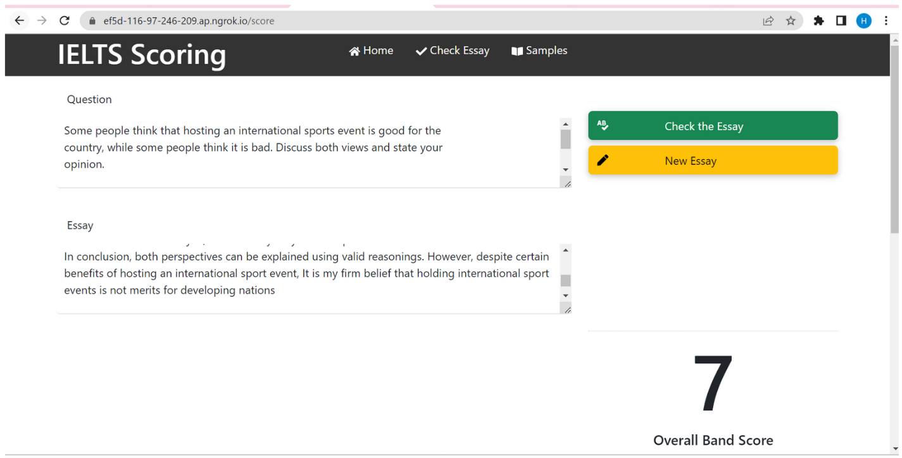
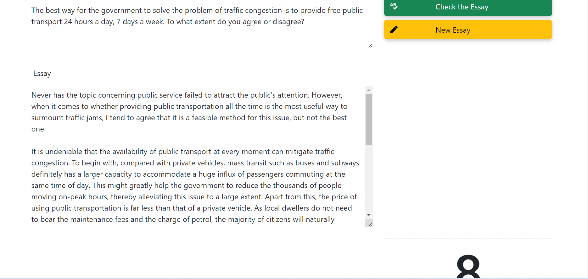

# IELTS-Essay-Scoring
## Introduction
Here is my python source code for project, which I and my friends completed. This project is building a tool that people learning IELTS writing can use. Every people took over some parts of project and my responsibity was pre-processing data and coding task response model.

  
   
  <i>Sample results</i>

## Motivation
In my team, all members want to conquire IELTS exam, especially writing IELTS. Studying IELTS has become a trend in today's society. Many individuals encouraged their children to take IELTS exam which can facilitate them have easy way to go to the universities but their student are under pressuer.
We know that IELTS writing is a difficult skill, so we decided to chose this topic and build a scoring tool.

